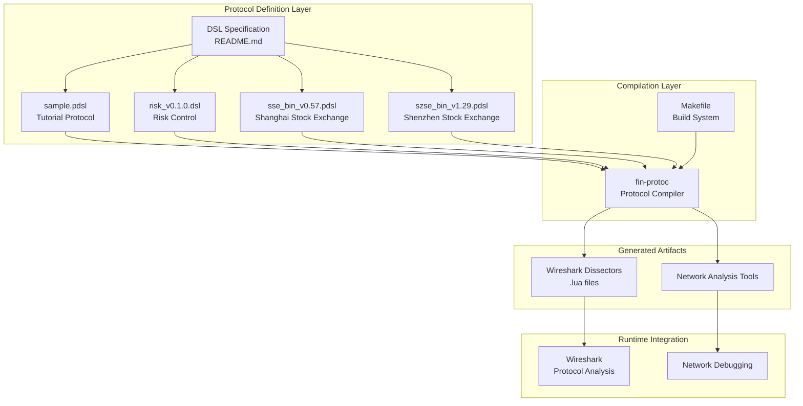
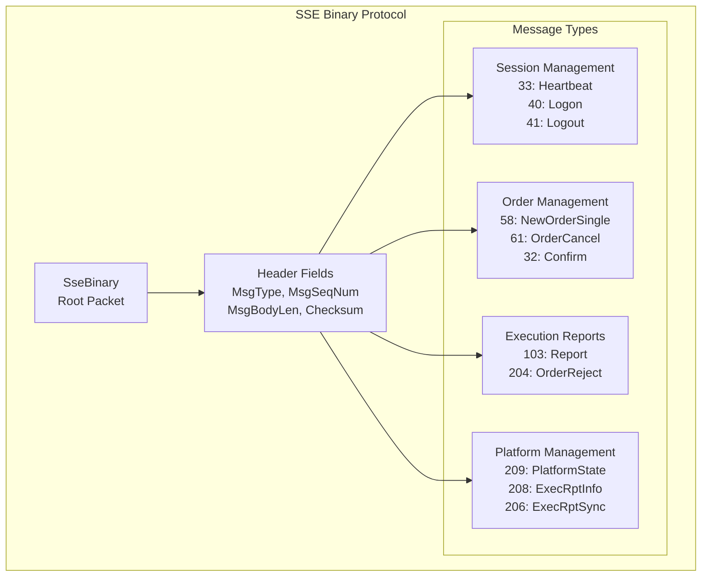
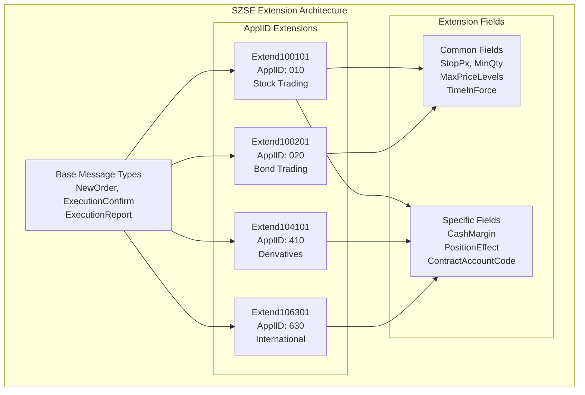
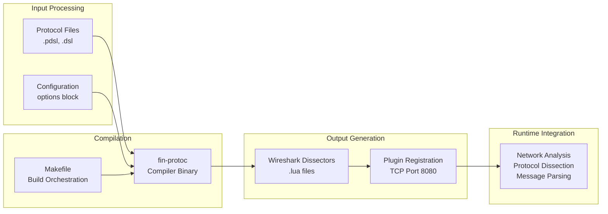

I'll write a comprehensive README for the fin-proto repository with UML diagrams in markdown format.

# fin-proto

A comprehensive protocol definition and code generation system specifically designed for financial trading protocols. [1](#0-0) This system provides a Domain Specific Language (DSL) for describing binary message formats used in financial exchanges and generates Wireshark dissectors for network analysis.

## Overview

The fin-proto system serves as a bridge between financial protocol specifications and practical network analysis tools, addressing the challenge of implementing and maintaining protocol parsers for complex financial trading systems.

### Key Features

- **Protocol Definition Language**: Specialized DSL for describing binary packet structures and message formats
- **Code Generation Pipeline**: Automated compilation from protocol definitions to Wireshark dissectors
- **Financial Domain Focus**: Built-in support for common financial trading patterns
- **Multi-Exchange Support**: Implementations for major Chinese stock exchanges (SSE, SZSE)

## System Architecture



## Protocol Implementations

### Supported Protocols

| Protocol     | File                  | Purpose                           | Root Packet  |
| ------------ | --------------------- | --------------------------------- | ------------ |
| Sample       | `sample.pdsl`         | Tutorial and testing              | `Sample`     |
| Risk Control | `risk_v0.1.0.dsl`     | Order management and risk control | `RcBinary`   |
| SSE Binary   | `sse_bin_v0.57.pdsl`  | Shanghai Stock Exchange trading   | `SseBinary`  |
| SZSE Binary  | `szse_bin_v1.29.pdsl` | Shenzhen Stock Exchange trading   | `SzseBinary` |

### SSE Binary Protocol Structure



### SZSE Binary Protocol Extension System



## DSL Syntax Overview

### Basic Structure

The fin-proto DSL supports several key constructs for defining binary protocols: [4](#0-3)

```

root packet PacketName {
fieldDefinitions
}

MetaData DataTypeName {
type fieldName `description`,
}

```

### Data Types

| Type    | Alias | Description                  |
| ------- | ----- | ---------------------------- |
| uint8   | u8    | 8-bit unsigned integer       |
| uint16  | u16   | 16-bit unsigned integer      |
| uint32  | u32   | 32-bit unsigned integer      |
| uint64  | u64   | 64-bit unsigned integer      |
| int8    | i8    | 8-bit signed integer         |
| int16   | i16   | 16-bit signed integer        |
| int32   | i32   | 32-bit signed integer        |
| int64   | i64   | 64-bit signed integer        |
| float32 | f32   | 32-bit floating point number |
| float64 | f64   | 64-bit floating point number |
| char    |       | Single character             |
| char[n] |       | Fixed-length character array |
| char[]  |       | Variable-length string       |
| string  |       | Variable-length string       |

### Protocol Configuration

Each protocol definition includes configuration options: [6](#0-5)

```

options {
StringPreFixLenType = u16;
RepeatPreFixSizeType = u16;
LittleEndian = false;
JavaPackage = "com.finproto.sse.bin.messages";
}

```

## Code Generation Pipeline



## Getting Started

### Prerequisites

- fin-protoc compiler (located at `~/workspace/fin-protoc/bin/`)
- Wireshark for protocol analysis
- Make build system

### Building Protocols

```bash
# Compile all protocols
make compile

# Individual protocol compilation
fin-protoc -f sample.pdsl -l sample/
fin-protoc -f risk/risk_v0.1.0.dsl -l risk/
fin-protoc -f sse/binary/sse_bin_v0.57.pdsl -l sse/binary/
fin-protoc -f szse/binary/szse_bin_v1.29.pdsl -l szse/binary/
```

### Using Generated Dissectors

1. Copy generated `.lua` files to Wireshark plugins directory [7](#0-6)
2. Restart Wireshark
3. Protocol dissection will automatically activate for TCP port 8080

## Financial Domain Features

### Message Type Routing

The protocols use sophisticated message type routing based on numeric identifiers: [8](#0-7)

### Metadata Type System

Financial-specific data types are defined for consistent field handling: [9](#0-8)

```bash
MetaData DataType {
    uint32 date `日期`,
    int64 price `价格`,
    int64 quantity `数量`,
    uint64 ntime `时间`,
}
```

### Extension Mechanisms

The SZSE protocol demonstrates advanced extension capabilities through ApplID-based message variants, allowing a single protocol definition to serve multiple trading applications. [10](#0-9)

## Repository Structure

```bash
fin-proto/
├── README.md                    # DSL syntax documentation
├── Makefile                     # Build system
├── sample.pdsl                  # Tutorial protocol
├── risk/
│   └── risk_v0.1.0.dsl         # Risk control protocol
├── sse/binary/
│   └── sse_bin_v0.57.pdsl      # Shanghai Stock Exchange
├── szse/binary/
│   └── szse_bin_v1.29.pdsl     # Shenzhen Stock Exchange
└── wireshark-plugin/
    └── sample.lua               # Example Wireshark dissector
```

## Contributing

When adding new protocols:

1. Follow the DSL syntax guidelines in README.md [11](#0-10)
2. Define appropriate metadata types for financial data
3. Use descriptive field names with Chinese descriptions where applicable
4. Test generated dissectors with Wireshark

## Notes

The fin-proto system is specifically designed for financial trading environments and includes comprehensive support for Chinese stock exchange protocols. The generated Wireshark dissectors enable real-time analysis of trading protocol traffic, making it valuable for debugging, monitoring, and compliance in financial trading systems. The extension system in SZSE protocols demonstrates the flexibility of the DSL for handling complex, multi-variant message structures common in financial exchanges.

[](https://deepwiki.com/xinchentechnote/fin-proto)
